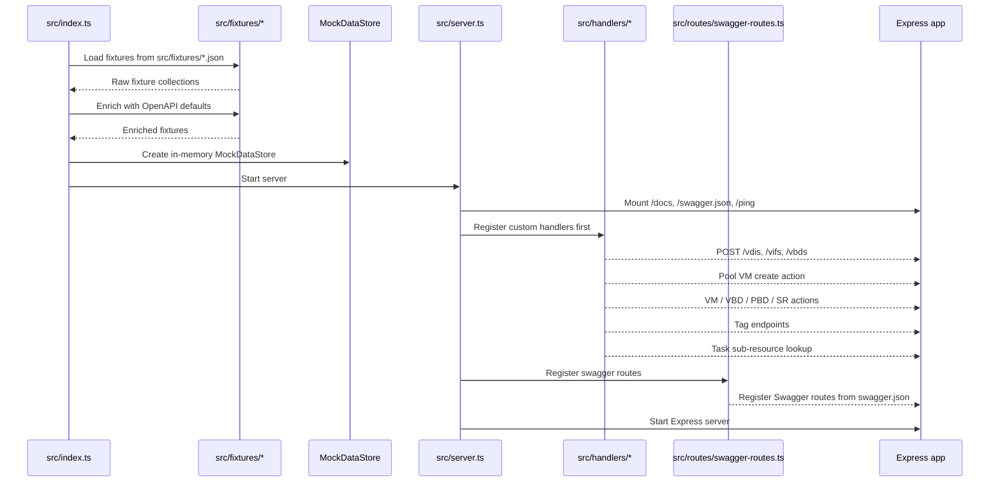
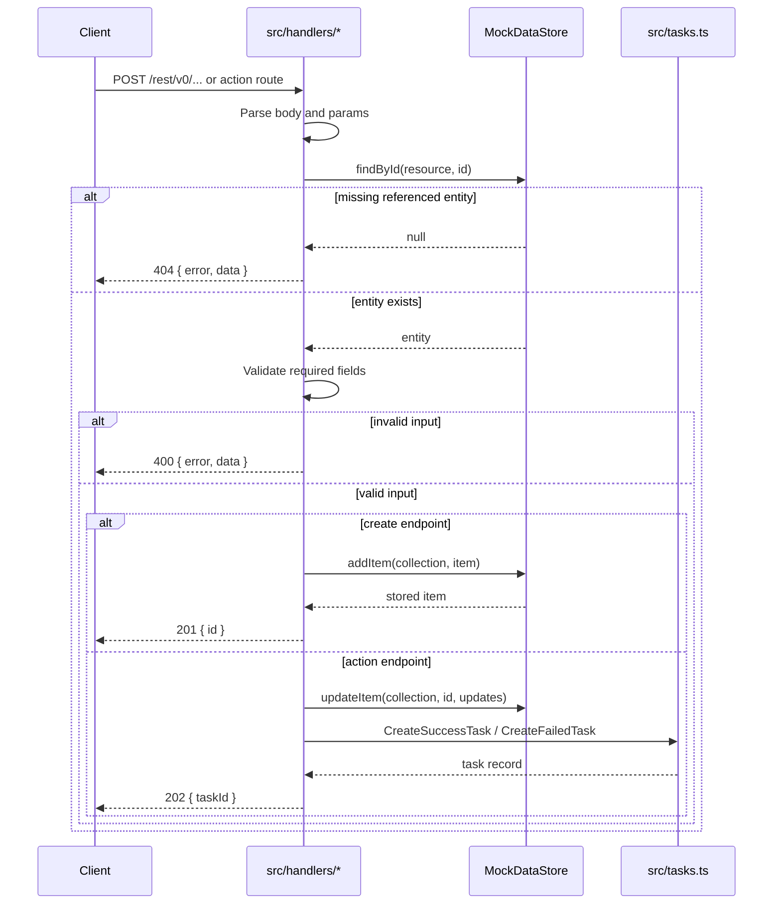

# XO API Simulator — Architecture



## How It Works

1. `src/index.ts` reads `PORT` and `FIXTURES_DIR`, loads fixtures, enriches them, and builds the shared `MockDataStore`.
2. `src/server.ts` creates the Express app, mounts `/docs`, `/swagger.json`, `/ping`, and then registers routes.
3. `src/server.ts` registers custom handlers before the generic Swagger-derived CRUD routes so custom endpoints win route matching.
4. `src/routes/swagger-routes.ts` now focuses on swagger-derived CRUD routes and the sub-resource fallback.
5. `src/handlers/` contains special endpoints that need explicit validation, resource lookups, or task creation.
6. Everything is backed by the in-memory `MockDataStore`, so the server is fast, disposable, and reset on restart.

## Request Flow

```text
HTTP request
  -> Express middleware
  -> custom handler if route matches
  -> generic Swagger route if not handled earlier
  -> read/write MockDataStore
  -> JSON response
```

## Custom Handler Flow



### What The Store Does

- `findById()` retrieves the referenced object from the in-memory collection.
- `addItem()` appends newly created objects to the target collection.
- `updateItem()` mutates an existing object in place and returns the updated record.
- `deleteItem()` removes a record when an action needs to delete or forget it.

### Why Custom Handlers Exist

They are used when the generic Swagger CRUD layer is not enough, for example when the endpoint must:

- validate required fields before creating an object
- verify related resources exist
- generate computed fields like `$pool`, `$VBDs`, or `uuid`
- return a task object instead of a direct resource response
- implement side effects such as VM power-state changes or VDI creation

## Main Pieces

- `src/index.ts`: entrypoint
- `src/server.ts`: Express bootstrap
- `src/fixtures/load-fixtures.ts`: fixture loading
- `src/fixtures/enrich-fixtures.ts`: schema defaults and computed fields
- `src/routes/swagger-routes.ts`: Swagger route generation
- `src/handlers/*`: custom endpoint logic
- `src/data-store.ts`: in-memory persistence layer
- `swagger.json`: source of generic route definitions
